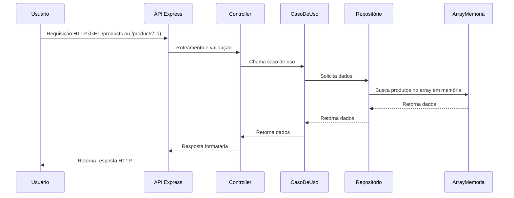

# Backend Marketplace Node

Este é um backend Node.js para uma aplicação de marketplace. Ele fornece uma base de dados em memória para testar sua API RESTful buscando dados de produtos.

## Endpoints

- **GET /products**
  Retorna lista de produtos.
  Parâmetro opcional: `orderBy` (`id`, `title`, `price`, `category`).
  [Testar em produção](https://marketplace-backend-node.onrender.com/products?orderBy=id)

- **GET /products/:id**
  Retorna detalhes de um produto específico pelo ID.
  [Testar em produção](https://marketplace-backend-node.onrender.com/products/10)

## Como executar o servidor

1. Instale as dependências:

    ```sh
    npm install
    ```

2. Configure o arquivo `.env` conforme necessário.

3. Execute o servidor em modo desenvolvimento:

    ```sh
    npm run dev
    ```

   O servidor estará disponível em `http://localhost:3333`.

## Stack Tecnológica

- Node.js
- Express
- TypeScript
- Zod (validação)
- Axios (HTTP client)
- Vitest & Supertest (testes)

## Funcionalidades

- **Buscar Produtos:** Recupera uma lista de produtos, com ordenação opcional.
- **Buscar Produto por ID:** Busca detalhes de um produto específico.
- **Validação e Tratamento de Erros:** Utiliza Zod para validação e erros personalizados.
- **Configuração de Ambiente:** Utiliza `.env` para variáveis de ambiente.

## Fluxo Principal (Mermaid)


